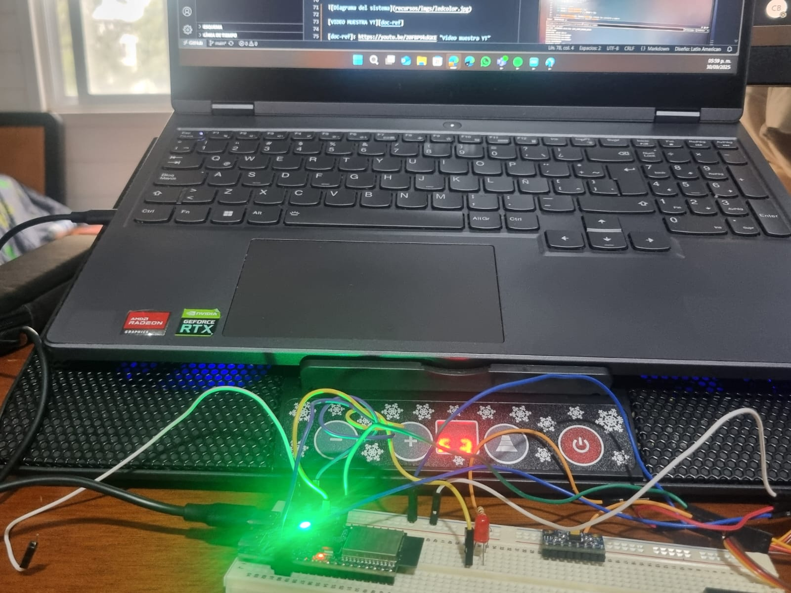

# 📚 Práctica 1 - NeoPixel_Básico

> El programa crea un efecto de parpedeo infinito de algun color que sepamos su "rgb", donde las personas no alcanzamos a distinguir. Ocupamos conceptos básicos de control de  LEDs RGB y temporización con delays. Es ideal si no comprendes el funcionamiento de los NeoPixels.

---

## 1) Resumén 📌

- **Equipo / Autor(es):** ANGELES BARRETO EMMANUEL, CEREZO PONCE JESUS ALFREDO
- **Curso / Asignatura:** Elementos Programables II  
- **Fecha:** 25/08/25  

---

## 2) Código ⌨️

```bash
# ========================================
 #LIBRERÍAS NECESARIAS
# ========================================
 #Desde el primer include hasta el "define" llevan #
include <Adafruit_NeoPixel.h>  // Librería para controlar LEDs NeoPixel RGB direccionables
ifdef __AVR__
   include <avr/power.h>  // Librería específica para placas AVR (optimización de energía)
endif

 #========================================
 #CONFIGURACIÓN DE CONSTANTES
 #========================================
define PIN  8          // Pin digital del ESP32 donde está conectado el LED NeoPixel
define NUMPIXELS 1     // Cantidad total de LEDs en la tira (en este caso solo 1)

# ========================================
# INICIALIZACIÓN DEL OBJETO NEOPIXEL
# ========================================
# Parámetros: cantidad de LEDs, pin de datos, tipo de LED (GRB) + frecuencia (800KHz)
Adafruit_NeoPixel pixels(NUMPIXELS, PIN, NEO_GRB + NEO_KHZ800);

# ========================================
# CONFIGURACIÓN INICIAL (se ejecuta una sola vez)
# ========================================
void setup(){
  Serial.begin(115200);  // Inicializar comunicación serial a 115200 baudios para debug
  pixels.begin();        // Inicializar el sistema NeoPixel (configurar pin como salida)
}

# ========================================
# BUCLE PRINCIPAL (se ejecuta infinitamente)
# ========================================
void loop(){
  // Paso 1: Apagar el LED (poner todos los colores en 0)
  pixels.clear();
  
  # Paso 2: Configurar el color del LED en índice 0
  # Color morado: Rojo=122, Verde=0, Azul=122
  # Valores van de 0 (apagado) a 255 (máximo brillo)
  pixels.setPixelColor(0, pixels.Color(122, 0, 122));
  
  # Paso 3: Enviar los datos al LED para que muestre el color configurado
  pixels.show();
  
  # Paso 4: Mantener el LED encendido durante 700 milisegundos (0.7 segundos)
  delay(700);
  
  # El ciclo se repite: el LED se apaga brevemente y vuelve a encender, creando un efecto de parpadeo en color morado
}

```
---

## 3) Evidencias del resultado final 📸



[VIDEO MUESTRA YT][doc-ref]

[doc-ref]: https://youtu.be/wxUKQ6KOWmY "Video muestra YT"


---
