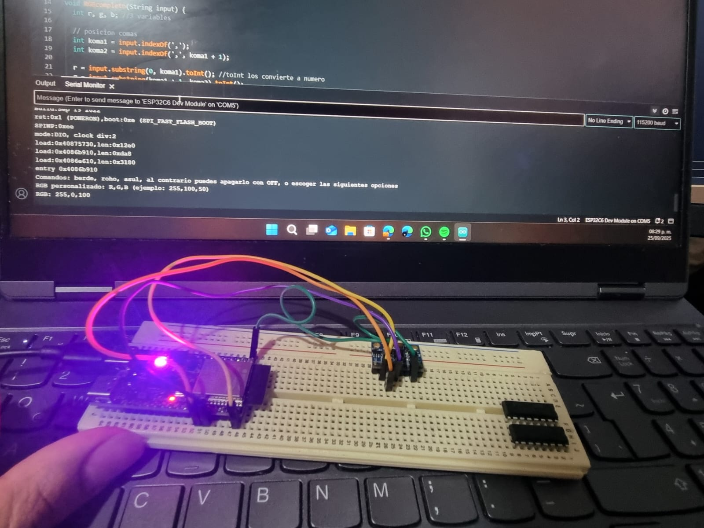

# 📚 Práctica 4 - Práctica_ComunicaciónSerial_NeoPixel

> El programa convierte el ESP32 en un "asistente de colores", que entiende comandos en "español", procesa la información usando funciones como indexof() y substring() para entender comandos. Es importante saber esto pues enseña conceptos de comunicación entre dispositivos (hardaware externo), como procesar datos de texto y uso de librerias.

---

## 1) Resumén 📌

- **Equipo / Autor(es):** Emmanuel Angeles Barreto
- **Curso / Asignatura:** Elementos Programables II  
- **Fecha:** 23/09/25  

---

## 2) Código ⌨️

```bash
# Librería para controlar LEDs NeoPixel de Adafruit
# Desde el primer include hasta el ultimo "define" llevan #
include <Adafruit_NeoPixel.h>
ifdef _AVR_
 include <avr/power.h> 
endif

# Configuración de constantes del sistema
define DELAYVAL 1000  # Tiempo de espera en milisegundos entre comandos
define PIN  8         # Pin digital donde está conectado el LED NeoPixel
define NUMPIXELS 1    # Cantidad de LEDs en la tira (solo 1 LED)

# Inicialización del objeto NeoPixel con configuración GRB y frecuencia 800KHz
Adafruit_NeoPixel pixels(NUMPIXELS, PIN, NEO_GRB + NEO_KHZ800);

String cmd = ""; # Variable global para almacenar los comandos recibidos por  serial

# Función para procesar colores RGB personalizados
void RGBcompleto(String input) {
  int r, g, b; # Variables para almacenar valores de Rojo, Verde y Azul (0-255)

  # Buscar la posición de las comas separadoras en el texto
  int koma1 = input.indexOf(',');           # Primera coma
  int koma2 = input.indexOf(',', koma1 + 1); # Segunda coma

  # Extraer y convertir cada valor RGB desde el string
  r = input.substring(0, koma1).toInt();             # Valor rojo: desde inicio hasta primera coma
  g = input.substring(koma1 + 1, koma2).toInt();     # Valor verde: entre las dos comas
  b = input.substring(koma2 + 1).toInt();            # Valor azul: después de la segunda coma

  # Aplicar el color al LED y mostrarlo
  pixels.setPixelColor(0, pixels.Color(r, g, b));  # Configurar color en el LED #0
  pixels.show();                                   # Enviar datos al LED para que se actualice
  delay(DELAYVAL);                                 # Pausa para estabilizar
  
  # Confirmar al usuario qué color se aplicó
  Serial.println("RGB: " + String(r) + "," + String(g) + "," + String(b));
}

# Configuración inicial que se ejecuta una sola vez
void setup() {
  Serial.begin(115200);  # Inicializar comunicación serial a 115200 baudios
  pixels.begin();        # Inicializar el sistema NeoPixel
  
  # Mostrar instrucciones de uso al usuario
  Serial.println("Comandos: berde, roho, asul, al contrario puedes apagarlo con OFF, o escoger las siguientes opciones");
  Serial.println("RGB personalizado: R,G,B (ejemplo: 255,100,50)");
}

# Bucle principal que se ejecuta infinitamente
void loop() {
  # Verificar si hay datos disponibles en el puerto serial
  if(Serial.available()>0){
    cmd = Serial.readStringUntil('\n');  # Leer comando hasta encontrar salto de línea
    cmd.trim();                          # Eliminar espacios en blanco al inicio y final
    
    # Determinar tipo de comando recibido y ejecutar acción correspondiente
    
    # Si contiene coma, es un comando RGB personalizado (ejemplo: 255,128,64)
    if(cmd.indexOf(',') != -1) {
      RGBcompleto(cmd);  # Llamar función para procesar valores RGB
    }
    # Comandos de colores predefinidos
    else if(cmd=="berde") {
      pixels.setPixelColor(0, pixels.Color(0,150, 0));  # Verde medio intensidad
      pixels.show(); 
      delay(DELAYVAL);
      Serial.println("color verde encendido");
    }
    else if(cmd=="roho") {
      pixels.setPixelColor(0, pixels.Color(150,0, 0));  # Rojo medio intensidad
      pixels.show();
      delay(DELAYVAL); 
      Serial.println("color roho encendido");
    }
    else if(cmd=="asul") {
      pixels.setPixelColor(0, pixels.Color(0,0, 150));  # Azul medio intensidad
      pixels.show(); 
      delay(DELAYVAL);
      Serial.println("color blue encendido");
    }
    # Comando para apagar el LED
    else if (cmd=="OFF") { 
      pixels.clear();   # Apagar todos los LEDs (poner en 0,0,0)
      pixels.show();    # Aplicar cambios
      delay(DELAYVAL);
      Serial.println("picsel apagado");
    }
    # Manejo de errores para comandos no reconocidos
    else {
      Serial.println("Comando no reconocido");
    }
  }
}
```
---

# 3) Evidencias del resultado final 📸



[VIDEO MUESTRA YT][doc-ref]

[doc-ref]: https://youtu.be/20FBP9kdGKE "Video muestra YT"


---
